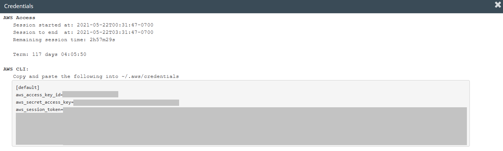

# Student: Louis Manabat (ID: s3719633)

## Contents Page:
- [Analysis and Solution](#Analysis-and-Solution)
    - [Analysis of the problem](#Analysis-of-the-problem)
    - [Explain and justify the solution](#Explain-and-justify-the-solution)
- [How to deploy the solutiion](#How-to-deploy-the-solutiion)
    - [Pre-requisites](#Pre-requisites)
        - [Manual installations](#Manual-installation)
        - [Semi-automatic installation](#Semi-automatic-installation)
    - [Setting up AWS Credentials](#Setting-up-AWS-Credentials)
    - [Running commands](#Running-commands)
        - [Pack](#Pack)
        - [SSH-key generation](#SSH-key-generation)
        - [Bootstrap](#Bootstrap)
        - [Initialise Terraform Repo](#Initialise-Terraform-Repo)
        - [Validate and Format](#Validate-and-Format)
        - [Terraform plan](#Terraform-plan)
        - [Deploy solution](#Deploy-solution)
        - [Get IP address/Link](#Get-IP-address/Link)
        - [Undeploy Solution](#Undeploy-Solution)

# Analysis and Solution
## Analysis of the problem
The process of creating an artefact has been automated to make it easier for the development team. With this now out of the way, there are new challenges that they face which is deploying the solution. There is a lot of manual workload present, which also means a lot of room for human error.

## Explain and justify the solution
The solution uses several tools to deploy the solution. The process will be semi-automated in the sense that the infrastructure and deployment will be fully automated, but to get it running, several Makefile commands need to be run to fully deploy the solution.

Tools:
GitHub: This is where the repository for the solution and the automation code will be stored on. In a further implementation of automating the process, CircleCI will be linked to GitHub to do CI/CD (Continuous Integration & Continuous Deployment)

Terraform: Terraform is the tool that automates the creation and updating of AWS services to help ease the process, and removes the need of having to create the services using manual labour. With this, it will lower the chances of using too many resources, meaning the company will save money, which then also means the company will gain a higher profit, which increases the satisfaction of the client. 

Ansible AWS: Ansible is the tool that deploys the solution onto an AWS EC2 virtual machine instance using what they call an automation playbook. This uses the services Terraform has created for Ansible to use and deploy the solution on. The means that any errors from manual labour are diminished, allowing a smoother process of deploying the solution to AWS.

AWS: This is the service where the client wants to deploy the solution onto. Services such as an EC2 virtual machine instance, VPCs, S3 buckets and DynamoDB will be used to help run the Todo App solution when it is deployed.

CircleCI: CircleCI was used to automate the packing of the artefact, from doing linting and vulnerability checks to making a packed solution. It will also be used to fully automate the deployment process.

# How to deploy the solutiion

Please note before getting started you must have an AWS account to get started. The way this tutorial will do it will differ from how you may do it, so please keep that in mind. We will be running this in VirtualBox using an Ubuntu 20.04 image.

## Pre-requisites

Before we get started, please make sure the following packages are installed:
1. curl
2. wget
3. make
4. dos2unix
5. vim
6. Terraform
7. Ansible 

You may choose to install these packages [**manually**](#Manual-installation), or do it [**automatically**](#Semi-automatic-installation) via the make command

## Manual installation
##### Please note that each line is a new command
### Updating system 
    sudo apt update -y
    sudo apt upgrade -y
    sudo apt install curl make wget vim dos2unix -y

#### Installing Node.js (For NPM)
    curl -fsSL https://deb.nodesource.com/setup_lts.x | sudo -E bash -
    sudo apt-get install nodejs -y

#### Installing Terraform
    cd /tmp/
    wget https://releases.hashicorp.com/terraform/0.15.4/terraform_0.15.4_linux_amd64.zip
    unzip terraform_0.15.4_linux_amd64.zip
    sudo mv terraform user/local/bin

#### Installing Ansible
    sudo apt install software-properties-common -y
    sudo add-apt-repository --yes --update ppa:ansible/ansible
    sudo apt install ansible -y


## Semi-automatic installation
##### Please note that each line is a new command
### Please run this command before starting the rest of the process
    sudo apt update -y
    sudo apt upgrade -y
    sudo apt install make -y

#### After successfully running that command, run the following commands (Each line is a new command)
    make install-deps
    make install-nodejs
    make install-tf
    make install-ansible


## Setting up AWS Credentials
##### Please note we will being using AWS Educate for this example

First login into AWS Educate and press the **My Classrooms** tab at the top. Find the course you are currently in and press the blue **Go to classroom** button on the right. Press **Continue** on the prompt that appears


Upon entering the next page, press the **Account Details** button and you will be greeted with a bunch of credentials. Copy the entire set of text in the gray box as we will be using this for later. 
### Please note that these credentials should only be used by you and you only! Do not share this with anyone else
<br>


<br>

After doing this, open up a new tab in your terminal and run the command `mkdir ~/.aws` then run `vim ~/.aws/credentials` then press **INS** to activate insert mode then **Shift + INS** to paste the credentials. Follow this up with pressing **CTRL + C** then type in `:wq` to save and exit vim.
<br>


## Running commands
After finishing the dependencies, go back into the root directory of the GitHub repository (where you have gotten this document you are reading) and enter the following commands:\

### Pack
The following command will pack and zip the solution into a tgz directory, which will be in the *ansible/files* directory.

    make pack

### SSH-key generation
The following command will create a SSH key which will be used when connecting to the Terraform infrastructure Virtual Machine later on.

    make ssh-gen

### Bootstrap
The following command will initialise and apply the Bootstrap code for DynamoDB, S3 bucket and option group for DynamoDB. You will only need to run this command once until you run [`make down`(#down)] (which we will cover later on).

    make bootstrap
You should get an output like this upon succession.
<br>


### Initialise Terraform Repo
The following command will initialise and apply the infrastructure code that will run the solution. You will only need to run this command once until you run [`make down`(#down)] (which we will cover later on).

    make tf-init
You should get an output like this upon succession.
<br>


### Validate and Format
The following command will check, validate and format the code. You will need to run this everytime you update your code.

    make tf-validate
You should get an output like this (or similar) upon succession. If not, go through the errors that are showing and re-run the `make tf-validate` command.


### Terraform plan
The following command will plan the code in a way that AWS will understand it prior to deploying the services to it. Please note that errors may appear and you will need to fix said errors then run [`make tf-validate`](#Validate-and-Format).

    make tf-plan
You should get an output like this upon succession. If not, go through the errors that are showing and re-run the `make tf-validate` command.


### Deploy solution
The following command will create the services on AWS then deploy the solution to the EC2 instance automatically. Please note if you get an error while deploying the services, it will instantly cancel the make command, meaning you need to fix the Terraform code up. You will need to run [`make tf-validate`](#Validate-and-Format) ***then*** [`make tf-plan`](#Terraform-plan).

    make up
You should see this first when successfully completing the deploying of services.
<br>

<br>
Then you should see this output (or similar) once the deployment of the solution is completed.
<br>


#### Please note If you do update the code after successfully running [`make up`](#Deploy-solution), you will need to re-run [`make tf-validate`](#Validate-and-Format) ***then*** [`make tf-plan`](#Terraform-plan) ***then*** [`make up`](#Deploy-solution)

### Get IP address/Link
The following command will get you the link and the IP address to access the solution online.

    make output
The command will output these variables (assuming the infrastructure is up)
<br>

<br>

The endpoint (long URL/long green square covering), will be the link used to access the solution. The output below that is the public IP address, and if you combine the IP with the port 5000 (i.e. '3.333.333.333:5000'),  it will also be a link to be used to access the solution.


### Undeploy Solution
The following command will destroy all AWS service, meaning the solution will not be avaliable to access. If you want to redeploy the solution, run [`make bootstrap`](#Bootstrap) ***then*** [`make tf-init`](#Initialise-Terraform-Repo) ***then*** [`make tf-validate`](#Validate-and-Format) ***then*** [`make tf-plan`](#Terraform-plan) ***then*** [`make up`](#Deploy-solution).

    make down
Successfully running the command should give these two outputs.
<br>
Infrastructure
<br>

<br>
Bootstrap
<br>


# About Simple Todo App

# Simple Todo App with MongoDB, Express.js and Node.js
The ToDo app uses the following technologies and javascript libraries:
* MongoDB
* Express.js
* Node.js
* express-handlebars
* method-override
* connect-flash
* express-session
* mongoose
* bcryptjs
* passport
* docker & docker-compose

## What are the features?
You can register with your email address, and you can create ToDo items. You can list ToDos, edit and delete them. 

# How to use
First install the depdencies by running the following from the root directory:
```
npm install --prefix src/
```

To run this application locally you need to have an insatnce of MongoDB running. A docker-compose file has been provided in the root director that will run an insatnce of MongoDB in docker. TO start the MongoDB from the root direction run the following command:

```
docker-compose up -d
```

Then to start the application issue the following command from the root directory:
```
npm run start --prefix src/
```

The application can then be accessed through the browser of your choise on the following:

```
localhost:5000
```

## Testing

Basic testing has been included as part of this application. This includes unit testing (Models Only), Integration Testing & E2E Testing.

### Linting:
Basic Linting is performed across the code base. To run linting, execute the following commands from the root directory:

```
npm run test-lint --prefix src/
```

### Unit Testing
Unit Tetsing is performed on the models for each object stored in MongoDB, they will vdaliate the model and ensure that required data is entered. To execute unit testing execute the following commands from the root directory:

```
npm run test-unit --prefix src/
```

### Integration Testing
Integration testing is included to ensure the applicaiton can talk to the MongoDB Backend and create a user, redirect to the correct page, login as a user and register a new task. 

Note: MongoDB needs to be running locally for testing to work (This can be done by spinning up the mongodb docker container).

To perform integration testing execute the following commands from the root directory:

```
npm run test-integration --prefix src/
```

### E2E Tests
E2E Tests are included to ensure that the website operates as it should from the users perspective. E2E Tests are executed in docker containers. To run E2E Tests execute the following commands:

```
chmod +x scripts/e2e-ci.sh
./scripts/e2e-ci.sh
```

## Deployable Package
A command has been included that allows you to package up the application into a deployable artifact (tarball). To do this, from the root directory, enter the following command:

```
make pack
```
This command will pack the application into a tar and copy it into the `ansible/files` folder that can be used by ansible to deploy to a target machine. 


## Terraform
### Bootstrap
A set of bootstrap templates have been provided that will provision a DynamoDB Table, S3 Bucket & Option Group for DocumentDB in AWS. To set these up, ensure your AWS Programmatic credentials are set in your console and execute the following command from the root directory

```
make bootstrap
```

### Initalising your TF Repo
To initialise your terraform repo, run the following commands from your root directory

```
make tf-init
```

### Validate your TF Code
To validate & format your terraform repo, run the following command from your root directory

```
make tf-validate
```


###### This project is licensed under the MIT Open Source License
